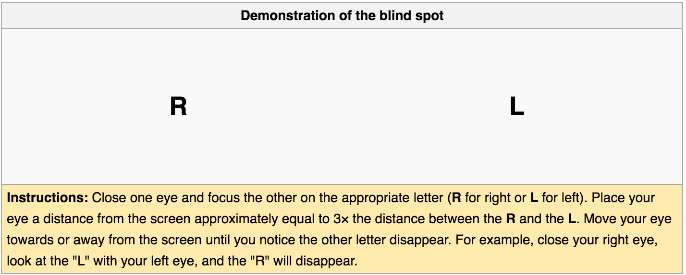

## The brain

### Blind spot [^brain-blind-spot]

- (see 'Incognito' book, David Eagleman)
- (see 'Sleights of Mind: What the neuroscience of magic reveals about our brains' book)

[^brain-blind-spot]: https://en.wikipedia.org/wiki/Blind_spot_(vision)

### Cornsweet-Craik-O'Brien illusion

[^cornsweet-illusion]

_"In the image , the entire region to the right of the "edge" in the middle looks slightly lighter than the area to the left of the edge, but in fact the brightness of both areas is exactly the same._

[^cornsweet-illusion] image by Fibonacci https://commons.wikimedia.org/w/index.php?curid=1788932 , https://en.wikipedia.org/wiki/Cornsweet_illusion

### System 1 and System 2 [^the-smarter-screen--system-1-2]

  - _"Psychologists Keith Stanovich and Ricard West famously divided the mind into two modes, 'System 1' and 'System 2', The first is fast and automatic, driven by emotions and instinct. It relies on cues we're often not aware of. System 2, on the other hand, is reflective and deliberate - it focuses the information we're consciously paying attention to"_
    - these are the 'two modes of thinking' mentioned in this book

[^the-smarter-screen--system-1-2]: "The Smarter Screen" book, Sholome Benartzi, p59
