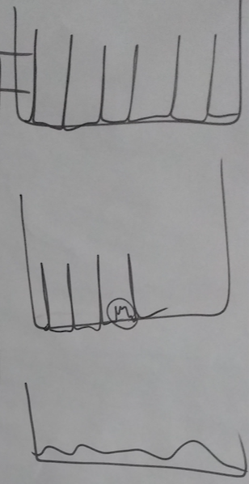
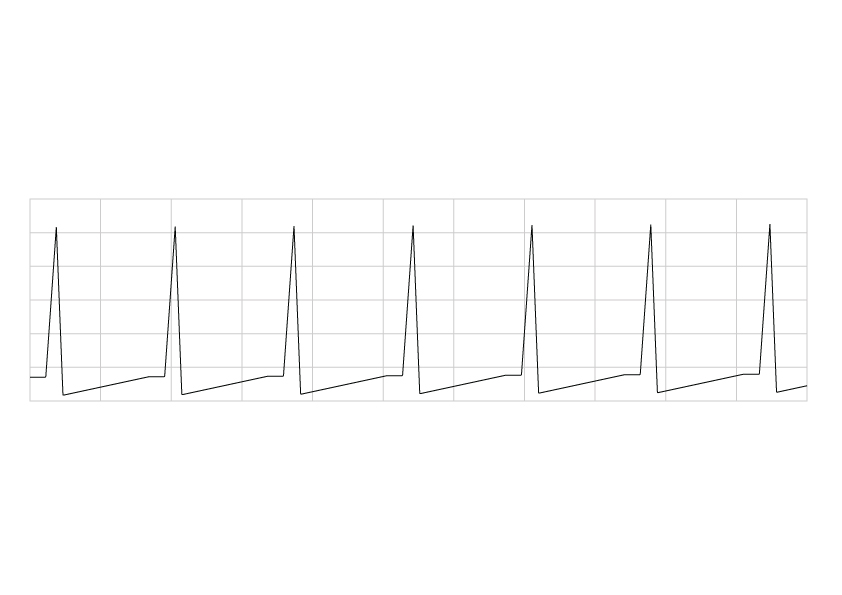
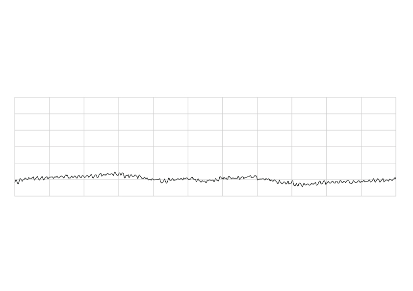

### 5.Test execution and lack of visibility

-this graph is trying to show are unit tests execution (with attack payloads) at a regular interval

- the one at the top (on both images) represents the test execution, which is kinda of an heartbeat
- the one with the flat line (2nd drawing on 1st pic) represents lack of visibility into those attacks
- the one with the heartbeat and the extra activity (2nd drawing on 2nd pic) represents the detection of an attack
- the last drawing on the 2nd pic, represents the normal network traffic (with no ability to detect attacks)

*draft diagrams*

*work in progress diagrams*

- image size should just be the graph (note the extra white space in this page)
- baseline should be flat (i.e. the only spikes are the ones created by the test execution)
- add x axis of: time
- add y axis of # of tests executed
- make the line green

- image size should just be the graph (note the extra white space in this page)
- x axis: time
- y axis: # of requests
- add a couple 'mountains' (to represent more traffic)

**References**

- [Measure Anything, Measure Everything](https://codeascraft.com/2011/02/15/measure-anything-measure-everything)
- [A Whirlwind Tour of Etsy's Monitoring Stack](http://www.slideshare.net/mrtazz/etsy-monitoring)
- [Metrics-Driven Engineering at Etsy](http://www.slideshare.net/mikebrittain/metrics-driven-engineering-at-etsy)
