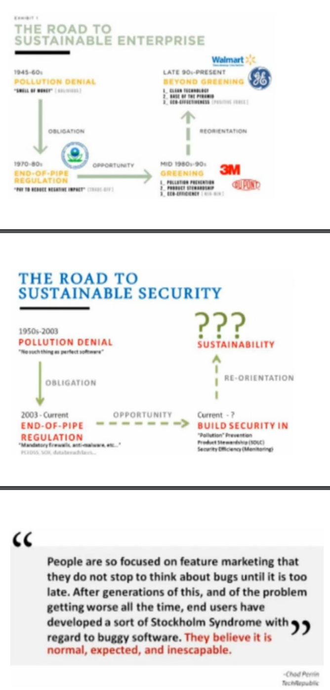

## Solutions

ENOUGH TALK ABOUT PROBLEMS!!!! Lets look at some solutions

**Security as pollution** (see _2.Quality and Security -> 3.The pollution analogy_)

David Rice’s amazing presentation at OWASP AppSec USA

- If you haven’t seen David Rice’s Presentation at OWASP AppSec USA 2010 ... you HAVE to see it ASAP....

If we can make the case that ‘Web Application Security can help with Effectiveness and increase Competitive Advantage’ we will finally be in a position to change the market dynamics

**Business case for Application Security**

You (and governments and companies) need to embrace application security, not because you care, but because it can be made to be an competitive advantage

With application security (when used as business intelligence) you will be able to:
 * understand how your application work
 * be more productive
 * be more efficient and effective
 * be faster to market
 * have a better brand
 * sell more

**Proposed revised Computer Crime LAW**

- Focus on Intent
- Make cyber crimes to have direct mapping to real world laws (that we already have): Theft, Destruction, Blackmail
- Allow (and encourage) Ethical Hacking
- Mandate disclosure of known security vulnerabilities (Health and Safety model)
  - This could be done privately first with a time limit for public disclosure
- Promote/encourage the development of application security technology (for both attacking and defending)
- Mandate higher standards for public bodies

It’s our turn

The government had 10 years to do anything about it, and so far, their actions (laws and regulations) are not working
- So let us (the experts) try in now, give us a change to make it work
- We (the experts) care because we are the ones that will have to clean up
the mess
- We (the experts) care because we are the ones that are becoming targets
- Note that the current system is not working (how many software/
application prosecutions and arrests have happened in the last 10 years?)

**Let us Hack you!** (note this shouldn't be part of a 'Solution')

There is enough talent in this room to bring down most (if not all) web infrastructure of Portugal (and that would probably the ‘least’ damaging scenario’)

It is scary that a small number of individuals can bring down (or seriously damage) significant parts of our infrastructure

Do you want to bet?

Would you bet your website against the OWASP Leaders Team that are here?

Unfortunately the processing power that we have here in this room, we can bring down a very large number of websites (using basic attacks)

If you don’t think that this is real, why don’t you let us do it?

Lets play the game of: “Bring the internet down for a day/hour/minute” (think of it like a country wide fire-drill)

What would happen in Portugal if the Internet was down for 1 hour, 1 day, 1 week?

**Question: who do you want to be attacked by?**

a kid that defaces your website and puts a big banner saying “You’re hacked”
- a kid that sends so much traffic to your site that you know something wrong
is going on and you do something about it
- a criminal that exploits your weakness slowly (i.e. undetected) and creates big
financial (or operational) damage to your company/organization or clients
- a criminal that corrupts your database
- a security professional, that knows what he/she is doing and can help you to
fix the problem?

**Portugal could become the ‘Switzerland of Hacking’**

Portugal really needs new ideas .... and business models

... let us show how one sector can do it right

... with energy, passion and focus

Portugal could become the ‘Switzerland of Hacking’

- lots of talent would be developed here
- lots of talent would come to Portugal
- new business would appear
- new business models would appear
- Portugal would become a technology power house
- We have the raw talent that is needed
- We are actually quite good at technology
- Out IT systems (telecoms, banking, government) are actually quite good (at
- least from a usability point of view (can’t comment on security :) )
