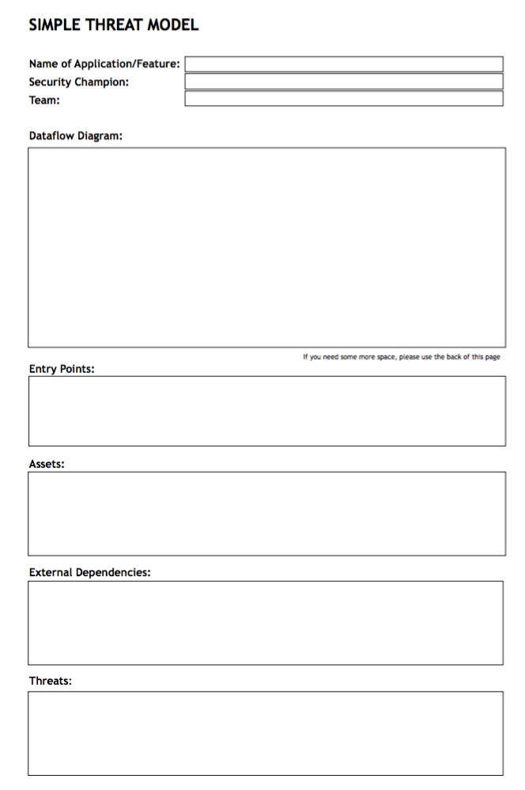

## Threat Modeling

### Simple Threat Model (template)

A common question when starting to do Threat Models is 'How do I start?'[^diniscruz-simple-threat-model].

To make this process easier, this simple '1 page Threat Model' helps to kickstart the process (the fact that it is an analog process is part of the exercise)

The idea is to map out the:

- Data Flow Diagrams (i.e app architecture)
- Entry Points (i.e Attack surface)
- Assets (i.e. what is valuable and needs to be protected)
- External Dependencies and Trust Levels (for example the URLs)
- Threats

[^diniscruz-simple-threat-model]: "Simple Threat Model (template) - Good place to start"  http://blog.diniscruz.com/2016/03/simple-threat-model-template-good-place.html

### Questions to ask

  - (see good list at http://www.grahamlea.com/2015/07/microservices-security-questions/)

### STRIDE

What is it [^dominik-javaone-2014]

  - *Spoofing*: Pretending to be somebody else
  - *Tampering*: Modifying data that should not be modifiable
  - *Repudiation*: Claiming someone didn’t do something
  - *Information Disclosure*: Exposing information
  - *Denial of Service*: Preventing a system from providing service
  - *Elevation of Privilege*: Doing things that one isn’t supposed to do

[^dominik-javaone-2014]: Slide 10 from http://files.dominikschadow.de/event_javaone2014-con2585.pdf

### Addressing each threat [^dominik-jax-2016]

  - Mitigate
  - Eliminate
  - Transfer
  - Accept

[^dominik-jax-2016]: http://files.dominikschadow.de/event_jax2016.pdf

### Threat Modeling Vocabulary [^threat-model-vocabulary]

- "Hard to build (JSON) format for Threat Modeling export when ppl can't agree on even what they're doing" [^m1splacedsoul-threat-model]

- "building coherent concept maps are really hard especially when builders and breakers can't even agree on terms." [^marinusva-threat-model]

[^m1splacedsoul-threat-model] John Steven, @m1splacedsoul -
[^marinusva-threat-model] @marinusva - https://twitter.com/marinusva/status/727169396150550529

[^threat-model-vocabulary] (check license and ask John for source files) https://www.cigital.com/blog/threat-modeling-vocabulary/

### Threat models maintenance

* frequent threat models are needed (ideally for every change to the app's: architecture, attack surface or security assumptions)
* push for the creation of solutions to scale and automate threat models, for example the creation of Diagrams from code [^diagrams-from-code]
* Allow Application Security to be come a source of truth [^appsec-as-truth]

[^diagrams-from-code]: See chapter 'Diagrams from Code'
[^appsec-as-truth]:  See chapter 'Application Security as source of truth'

*to review*

  - "Developer-Driven Threat Modeling", article, http://www.infoq.com/articles/developer-driven-threat-modeling
  - "Risk Assessment and Threat Modeling", article https://developer.apple.com/library/mac/documentation/Security/Conceptual/Security_Overview/ThreatModeling/ThreatModeling.html
  - "Application Threat Modeling In Risk Management" presentation http://www.slideshare.net/MelDrews/application-threat-modeling-in-risk-management
  - "Attack trees" , B. Schneier, page https://www.schneier.com/cryptography/archives/1999/12/attack_trees.html
  - "Threat Assessment and Remediation Analysis Methodology Description", pdf , https://www.mitre.org/publications/technical-papers/threat-assessment--remediation-analysis-tara

  - "Security Training: #3 Threat Modelling - Practices and Tools" http://www.slideshare.net/YulianSlobodyan/3threat-modelling-practices-and-tools
